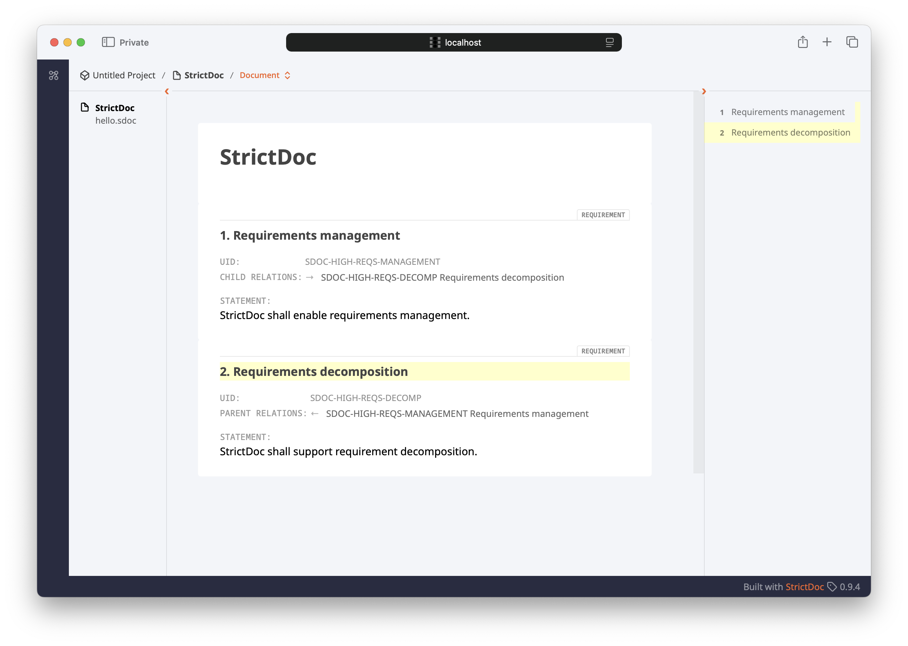

# OSLC Requirements Management server for StrictDoc

## Overview

[StrictDoc](https://github.com/strictdoc-project/strictdoc) is a simple yet rigorous tool for requirements management. It aims to provide a plaintext requirements management sufficient for demonstrating conformance with ISO 26262, DO178 and similar standards (when combined with Git for configuration management and human-followed processes otherwise stipulated).

This project provides a simple showcase of how an OSLC server for the Requirements Management domain could be added to the output of the HTML output of the StrictDoc, which is a static site.

The main utility of such OSLC server would be to enable traceability with a higher fidelity than just pasting permanent links in the description field, e.g. in Jira.

## Getting started

### Run the OSLC server

The OSLC server is a .NET application that includes a static website hosting, which we leverage to reduce the number of moving parts in this solution. It uses [OSLC4Net](https://github.com/OSLC/oslc4net) for OSLC REST API implementation assistance.

Install .NET 9 (you may also need to trust the HTTPS cert dotnet installs for localhost) and run:

```
cd src/StrictDocOslcRmServer/StrictDocOslcRm
dotnet run
```

### (Optional) Rebuild the requirements site

Install [uv](https://docs.astral.sh/uv/) for Python first. Then run:

```sh
cd src/hellow-requirements/
uvx --from=https://github.com/berezovskyi/strictdoc@b-conneg-uris --no-cache strictdoc export --formats html,json hello.sdoc
```


## Exploring the OSLC services

We will start with a standardized well-known endpoint for OSLC:

```sh
curl -X GET 'https://localhost:7000/.well-known/oslc/rootservices.xml'
```

We will then proceed to list the services in the OSLC catalog:

```sh
curl -X GET 'https://localhost:7000/oslc/catalog' \
  --header 'Accept: text/turtle;q=0.9, application/rdf+xml;q=0.7, application/ld+json;q=0.5, application/n-triples;q=0.3' \
  --header 'OSLC-Core-Version: 2.0'
```

In our implementation, one StrictDoc document is mapped to one OSLC Service Provider. We can obtain the metadata for a specific provider in the catalog:

```sh
curl -X GET 'https://localhost:7000/oslc/service_provider/e526fe19bd024f2ea7c84b9bccaf1243' \
  --header 'Accept: text/turtle;q=0.9, application/rdf+xml;q=0.7, application/ld+json;q=0.5, application/n-triples;q=0.3' \
  --header 'OSLC-Core-Version: 2.0'
```

We can proceed to query all requirements within a given OSLC provider (i.e, within a StrictDoc document):

```sh
curl -X GET 'https://localhost:7000/oslc/service_provider/e526fe19bd024f2ea7c84b9bccaf1243/requirements' \
  --header 'Accept: text/turtle;q=0.9, application/rdf+xml;q=0.7, application/ld+json;q=0.5, application/n-triples;q=0.3' \
  --header 'OSLC-Core-Version: 2.0'
```

That would produce the following response graph:


```turtle
@prefix rdf: <http://www.w3.org/1999/02/22-rdf-syntax-ns#>.
@prefix rdfs: <http://www.w3.org/2000/01/rdf-schema#>.
@prefix xsd: <http://www.w3.org/2001/XMLSchema#>.
@prefix dcterms: <http://purl.org/dc/terms/>.
@prefix oslc: <http://open-services.net/ns/core#>.

<https://localhost:7000/?a=SDOC-HIGH-REQS-DECOMP> 
    a <http://open-services.net/ns/rm#Requirement>;
    <http://open-services.net/ns/rm#decomposes> <https://localhost:7000/?a=SDOC-HIGH-REQS-MANAGEMENT>;
    dcterms:identifier "SDOC-HIGH-REQS-DECOMP";
    dcterms:title "Requirements decomposition"^^rdf:XMLLiteral;
    dcterms:description "StrictDoc shall support requirement decomposition."^^rdf:XMLLiteral.

<https://localhost:7000/?a=SDOC-HIGH-REQS-MANAGEMENT> 
    a <http://open-services.net/ns/rm#Requirement>;
    dcterms:identifier "SDOC-HIGH-REQS-MANAGEMENT";
    dcterms:title "Requirements management"^^rdf:XMLLiteral;
    dcterms:description "StrictDoc shall enable requirements management."^^rdf:XMLLiteral.
```

Opening the `https://localhost:7000/?a=SDOC-HIGH-REQS-DECOMP` in the browser navigates directly to the requirement within the corresponding document:


